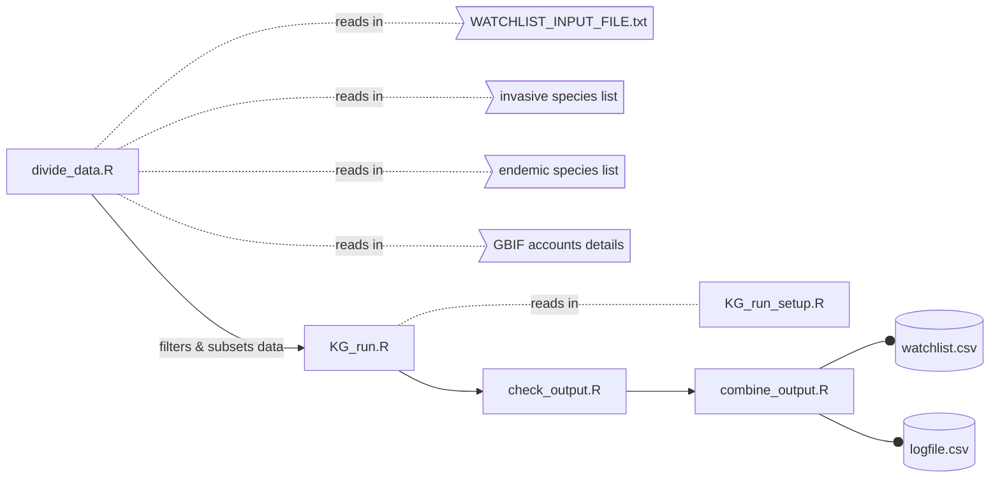
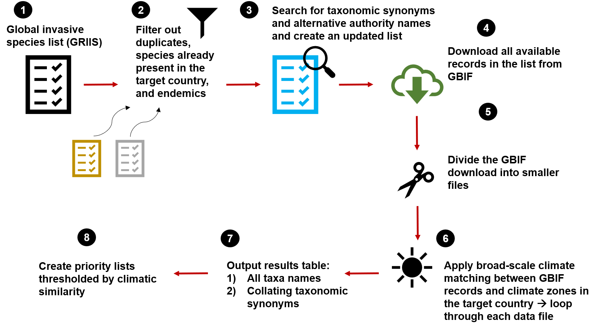

# Köppen-Geiger watchlist: Parallel Processing 🗺️
### Broad-scale Köppen-Geiger (KG) based climate matching to prioritise invasive species and generate watchlists

-------------------------------------

**Clarke J.M van Steenderen**    
clarke.vansteenderen@ru.ac.za  
**Guy F. Sutton**    
g.sutton@ru.ac.za  
**Philip Ivey**     
p.ivey@ru.ac.za

-------------------------------------

Centre for Biological Control    
Department of Zoology and Entomology    
Rhodes University      
Makhanda/Grahamstown    
6139    

-------------------------------------

## :spider: Run instructions

* Download this GitHub repository, and unzip the project folder
* Edit the **``WATCHLIST_INPUT_FILE.txt``** according to the specific project requirements    
* Upload the project folder to your profile on a High Performance Computer (HPC) of choice
* Access a node of the HPC that has access to the Internet (since GBIF downloads require an Internet connection), e.g ``ssh cvansteenderen@globus.chpc.ac.za``
* cd (change the directory) to the relevant folder/directory on your HPC profile
* Add the most recent version of R as a module, e.g. ``module load chpc/BIOMODULES R/4.2.0``
* Run ``Rscript divide_data.R`` to divide the invasive species list into **n** subsets (depending on the number of GBIF accounts available for use; e.g. 16 email addresses x 3 simultaneous downloads allowed per user = 48). Change the 1..48 to 1..n, whatever the value of n is for the particular analysis
* Run ``for p in {1..48}; do nohup Rscript KG_run.R "${p}" &> "RUNS/RUN${p}/RUN${p}.out" & done`` to trigger the analysis
* Run ``check_output.R`` to see whether all the subsets completed successfully. If not, a list is returned of the folders that should be re-run
* Run ``Rscript combine_output.R`` to combine all the parallel runs into one output file and one log file



An example of the console input could be:      

```
# ssh into the globus node
ssh cvansteenderen@globus.chpc.ac.za 
# password 
Cryophytum2024@!
# change working directory
cd /mnt/lustre/users/cvansteenderen/kg_watchlist_MULTI_automated
# add the relevant R module
module load chpc/BIOMODULES R/4.2.0
# type this to do away with warnings on startup of R
export LANG=en_US.UTF-8 
export LC_ALL=en_US.UTF-8
# divide the data in n subsets, and set up the analysis
Rscript divide_data.R
# run the analysis, such that all 48 subsets are running in parallel
for p in {1..48}; do nohup Rscript KG_run.R "${p}" &> "RUNS/RUN${p}/RUN${p}.out" & done
```

To check whether all the runs are complete:

```
Rscript check_output.R
```

Which will produce one of two messages:

```ALL 48 RUNS COMPLETED SUCCESSFULLY``` 

or a list of folder RUN numbers that did not complete (e.g. 1 and 3)

```
These subsets did not complete: 1 3
Run this on the command line (or HPC):
for p in 1 3; do nohup Rscript KG_run.R "${p}" &> "RUNS/RUN${p}/RUN${p}.out" & done
```

Combine output if everything is done:

```
Rscript combine_output.R
```


```FINAL WATCHLIST FILE WRITTEN TO: ~path/WATCHLIST_OUTPUT.csv```    
```FINAL LOG FILE WRITTEN TO: ~path/WATCHLIST_LOG_OUTPUT.txt```

The console will appear as something like this:

```
To run a command as administrator (user "root"), use "sudo <command>".
See "man sudo_root" for details.

clarke@DESKTOP-QOA94I2:~$ ssh cvansteenderen@globus.chpc.ac.za
cvansteenderen@globus.chpc.ac.za's password:
Last login: Tue May 21 18:06:54 2024 from 8ta-246-129-164.telkomadsl.co.za
[cvansteenderen@globus ~]$ cd /mnt/lustre/users/cvansteenderen/kg_watchlist_MULTI_automated
[cvansteenderen@globus kg_watchlist_MULTI_automated]$ module load chpc/BIOMODULES R/4.2.0
[cvansteenderen@globus kg_watchlist_MULTI_automated]$ export LANG=en_US.UTF-8
[cvansteenderen@globus kg_watchlist_MULTI_automated]$ export LC_ALL=en_US.UTF-8
[cvansteenderen@globus kg_watchlist_MULTI_automated]$ Rscript divide_data.R
── Attaching packages ─────────────────────────────────────────────────────────────────────────────── tidyverse 1.3.2 ──
✔ ggplot2 3.5.0     ✔ purrr   1.0.2
✔ tibble  3.2.1     ✔ dplyr   1.1.4
✔ tidyr   1.3.1     ✔ stringr 1.5.1
✔ readr   2.1.5     ✔ forcats 0.5.2
── Conflicts ────────────────────────────────────────────────────────────────────────────────── tidyverse_conflicts() ──
✖ dplyr::filter() masks stats::filter()
✖ dplyr::lag()    masks stats::lag()

Attaching package: ‘magrittr’

The following object is masked from ‘package:purrr’:

    set_names

The following object is masked from ‘package:tidyr’:

    extract

Rows: 107045 Columns: 16
── Column specification ────────────────────────────────────────────────────────────────────────────────────────────────
Delimiter: ","
chr (15): scientific_name, scientific_name_type, kingdom, establishment_mean...
lgl  (1): accepted_name

ℹ Use `spec()` to retrieve the full column specification for this data.
ℹ Specify the column types or set `show_col_types = FALSE` to quiet this message.
Rows: 695 Columns: 20
── Column specification ────────────────────────────────────────────────────────────────────────────────────────────────
Delimiter: "\t"
chr (15): id, taxonID, scientificName, kingdom, phylum, class, order, family...
lgl  (5): acceptedNameUsageID, namePublishedIn, namePublishedInYear, vernacu...

ℹ Use `spec()` to retrieve the full column specification for this data.
ℹ Specify the column types or set `show_col_types = FALSE` to quiet this message.
[cvansteenderen@globus kg_watchlist_MULTI_automated]$ for p in {1..48}; do nohup Rscript KG_run.R "${p}" &> "RUNS/RUN${p}/RUN${p}.out" & done
[1] 31878
[2] 31879
[3] 31880
[4] 31881
[5] 31882
[6] 31883
[7] 31886
[8] 31888
[9] 31889
[10] 31890
[11] 31892
[12] 31893
[13] 31895
[14] 31896
[15] 31897
[16] 31899
[17] 31900
[18] 31901
[19] 31902
[20] 31903
[21] 31904
[22] 31905
[23] 31906
[24] 31907
[25] 31908
[26] 31909
[27] 31910
[28] 31911
[29] 31913
[30] 31914
[31] 31915
[32] 31916
[33] 31917
[34] 31918
[35] 31920
[36] 31921
[37] 31922
[38] 31923
[39] 31924
[40] 31925
[41] 31926
[42] 31927
[43] 31928
[44] 31929
[45] 31930
[46] 31931
[47] 31932
[48] 31933
[cvansteenderen@globus kg_watchlist_MULTI_automated]$ Rscript check_output.R

****ALL 48 RUNS COMPLETED SUCCESSFULLY****

[cvansteenderen@globus kg_watchlist_MULTI_automated]$ Rscript combine_output.R
```

The list of numbers from [1] to [48] are job numbers allocated by the HPC.

### To re-run specific folders/subsets of choice (e.g. 23, 32, 37, 38, and 46), you can run:        

```
# ssh into the globus node
ssh cvansteenderen@globus.chpc.ac.za 
# password 
Cryophytum2024@!
# change working directory
cd /mnt/lustre/users/cvansteenderen/kg_watchlist_MULTI_automated
# add the relevant R module
module load chpc/BIOMODULES R/4.2.0
# type this to do away with warnings on startup of R
export LANG=en_US.UTF-8 
export LC_ALL=en_US.UTF-8
# run specific RUN folders
for p in 23 32 37 38 46; do nohup Rscript KG_run.R "${p}" &> "RUNS/RUN${p}/RUN${p}.out" & done
# check whether all folders contain output -> i.e. an output table was written to all
Rscript check_output.R
# combine output if satisfied
Rscript combine_output.R
```

💡Note that the ``divide_data.R`` script is not run again here, as it was already done the first time around.  We just need to run ``KG_run.R`` again, which will overwrite whatever is left in these target folders.

## 🪲 Workflow

This collection of R scripts follows the pipeline below:

* Input an Excel file containing a list of the genus and species names of invasive organisms of interest (e.g. from the Global Register of Introduced and Invasive Species [GRIIS](https://griis.org/) database)    
* Input the name of a country that is under potential threat from these species (focal country)     
* Remove all (1) all taxa already recorded in the focal country, and (2) endemic species (if available) from the list      
* The list of species will be divided into 48 smaller subsets to enable parallel processing. Each GBIF user is only allowed three simultaneous downloads. To get around this, there are 16 available email addresses, as listed in the **``email_addresses.csv``** file. Using all at once means that 48 downloads can run concurrently (16 x 3). This is why the original invasive species list is divided into 48 subsets, where groups of three can be allocated to a single GBIF user account. Each of the 48 RUN folders will contain an **``INPUT.csv``** file, specifying which GBIF user account to draw from, and the relevant login details.    
* Input a list of the Köppen-Geiger zones present in the focal country      
* Download all occurence records from GBIF for the taxa in the input list      
* Extract the KG climate zone for each occurence record (GPS location)     
* Score whether the KG zones where the invasive species occur are shared with the KG zones present in the focal country (0 or 1)    
* Score the total number of records per species that share a KG zone with the focal country, and the overall proportion        
* Score the total, and proportion of, records present in each target KG zone, and also record whether there are any records from the focal country already      
* Output a single summary table    
* A logfile will be written to the directory, called ``SKIPPED_SP_LOGFILE.txt``, which will display a list of any species names where errors occurred. These species are skipped.



## 👓 Code layout

* The ``KG_run.R`` and ``divide_data.R`` files are the main scripts that are run from the console. 
* ``divide_data.R`` reads in the ``WATCHLIST_INPUT_FILE.txt`` file and sets all the required user parameters, divides the invasive species list into 48 subsets, and allocates each data subset to a different RUN folder. Each RUN folder also gets its own ``INPUT.csv`` folder, specifying the path to the data subset, GBIF credentials to enable downloading, and other parameters specified in the ``WATCHLIST_INPUT_FILE.txt`` as edited by the user.
* ``KG_run_setup.R`` is called by ``KG_run.R``, and loads up the necessary libraries, reads in the input parameter file (``INPUT.csv``), creates output folders, and sets up the dataframes required for the analysis
* ``combine_output.R`` is also called by ``KG_run.R``, and combines the output from all 48 parallel runs back into one CSV file, and combines all the log files into one

💡The only file that the user needs to change is ``WATCHLIST_INPUT_FILE.txt``. If specific changes need to be made to the filtering of the invasive species list before it is divided into 48 subsets (e.g. more than one taxonomic kingdom, such as Plantae AND Animalia), then edits can be made in the ``divide_data.R`` file.

## Troubleshooting

⚠️ There may be times when the GBIF database is down or experiencing errors. For example, the error:    
``Timeout was reached: [occurrence-download.gbif.org] SSL/TLS connection timeout``, or        
``OpenSSL SSL_connect: SSL_ERROR_SYSCALL in connection to api.gbif.org:443`` might appear.    
Check the progress of the script run regularly. If an error occurred, write the latest version of the ``super_table`` object to the project directory as a CSV file, and create a new subset of your species list file from the last species that was processed. Use this as the new input, and re-run the script

⚠️ If a GBIF file is too large to read back into the R environment, an error might pop up saying something like this:    
``Opened 23.69GB (25433215792 bytes) file ok but could not memory map it. This is a 64bit process. There is probably not enough contiguous virtual memory available``    
Search the R script for the following line:    
``import_back_file <- rgbif::occ_download_import(result, nrows = 500000)``, and change ``nrows`` to a smaller value. Rerun the script, which now limits the number of rows read in. Alternatively, change the ``keep.downloads`` parameter in the INPUT.csv file to ``n``, which will automatically delete each downloaded folder after the relevant information has been extracted

⚠️ If your Internet connection is unstable, you might get the error:    
``Error occurred while fetching usageKey for species_name : any(content_types == "application/json") is not TRUE ``    
Ensure that you are running this R script on a computer that has uninterrupted Internet access and electricity supply

## 🐝 Input file

Below is a template and an example of the **``WATCHLIST_INPUT_FILE.txt``** file that the user needs to edit accordingly. The name **WATCHLIST_INPUT_FILE** should not be changed, and neither should any of the parameters in capital letters in the file. Check the species list csv file for the project to ensure the correct usage of the target country and taxonomic kingdom, and make sure that there is a single column in the file with both the genus and species name (no authority or other detail); for example ``Acacia saligna``, or ``Opuntia stricta``. The column name can be anything - here it is set to ``accepted_name.species``. Ensure that the same requirements are met for the file containing endemic species (if available); here it is ``full.tax.name``. If a list of endemics is not available, leave ``ENDEMICS LIST PATH`` and ``ENDEMICS NAME COLUMN`` blank. Enter the applicable Köppen-Geiger zones as numbers (see below for codes), separated by a comma. The file paths provided can be anything you like - just make sure that the relevant data is available at the path you have specified. The ``KEEP DOWNLOADS`` setting is best left at ``n``. This will save space on the HPC or on your hard drive, since the GBIF download will be deleted at the end of each iteration, after the relevant information has been extracted from it. If set to ``y``, each GBIF zipped folder will be stored (this can take up many GBs of space!).

### Template WATCHLIST_INPUT_FILE.txt

``SPECIES LIST PATH``	path/to/invasive_species_list.csv    
``ENDEMICS LIST PATH``	path/to/list_of_endemics.txt        
``TARGET COUNTRY``	country    
``KINGDOM``	taxonomic kingdom   
``ISO COUNTRY CODE``	country code (see ISO codes below)          
``SPECIES NAME COLUMN``	column in invasive species list specifying full taxonomic name (genus and species)       
``ENDEMICS NAME COLUMN``	column in endemic species list specifying full taxonomic name (genus and species)    
``KOPPEN-GEIGER ZONES``	koppen-geiger zone numbers (see table below), separated by a comma    
``OUTPUT FILE NAME``	name_of_output_table.csv    
``KEEP DOWNLOADS``	whether to keep each GBIF download (y or n)        
``NUMBER OF SPECIES TO PROCESS`` optional to specify the number of species to process for a test run. If left blank, defaults to all species in the list    

### Example WATCHLIST_INPUT_FILE.txt

``SPECIES LIST PATH``	griis_data/griis_full_database.csv    
``ENDEMICS LIST PATH``	mau_endemics/native_flowering_plants_mau.txt        
``TARGET COUNTRY``	Mauritius    
``KINGDOM``	Plantae    
``ISO COUNTRY CODE``	MU    
``SPECIES NAME COLUMN``	accepted_name.species    
``ENDEMICS NAME COLUMN``	full.tax.name    
``KOPPEN-GEIGER ZONES``	1, 2, 3, 14    
``OUTPUT FILE NAME``	final_sp_table.csv    
``KEEP DOWNLOADS``	n    
``NUMBER OF SPECIES TO PROCESS``  		  

## 🐛 SPECIES LIST PATH -> the list of invasive species of interest

In this example, the file ``griis_full_database.csv`` contains 3083 plant species names that are a potential threat to Mauritius. The table below shows the first three species in this table. 

| scientific_name       | scientific_name_type | kingdom | establishment_means | is_invasive | occurrence_status | checklist.name | checklist.iso_countrycode_alpha3 | accepted_name.species | accepted_name.kingdom | accepted_name.phylum | accepted_name.class | accepted_name.order | accepted_name.family | accepted_name.habitat | accepted_name |
|-----------------------|----------------------|---------|---------------------|-------------|-------------------|----------------|----------------------------------|-----------------------|-----------------------|----------------------|---------------------|---------------------|----------------------|-----------------------|---------------|
| Abelmoschus moschatus | species              | Plantae | alien               | invasive    | present           | Cook Islands   | COK                              | Abelmoschus moschatus | Plantae               | Tracheophyta         | Magnoliopsida       | Malvales            | Malvaceae            | ["terrestrial"]       | NA            |
| Abies alba Mill.      | species              | Plantae | alien               | invasive    | present           | Sweden         | SWE                              | Abies alba            | Plantae               | Tracheophyta         | Pinopsida           | Pinales             | Pinaceae             | ["terrestrial"]       | NA            |
| Abrus precatorius L.  | species              | Plantae | alien               | invasive    | present           | Bahamas        | BHS                              | Abrus precatorius     | Plantae               | Tracheophyta         | Magnoliopsida       | Fabales             | Fabaceae             | ["terrestrial"]       | NA            |

## 🦋 ENDEMIC SPECIES LIST PATH -> the list of endemic taxa in the focal country

In this example, the file ``native_flowering_plants_mau.txt`` contains 695 endemic flowering plant species names that are endemic to Mauritius, taken from [GBIF](https://www.gbif.org/dataset/649fb99c-5bb1-4a3b-83df-7f9b3fe4dca6#description). The table below shows the first three species in this table. The column ``full.tax.name`` was created manually here to provide an input that contains the genus and species together.

| id | taxonID | acceptedNameUsageID | scientificName | namePublishedIn | namePublishedInYear | kingdom | phylum | class | order | family | genus | specificEpithet | full.tax.name | taxonRank | scientificNameAuthorship | vernacularName | taxonomicStatus |
|---|---|---|---|---|---|---|---|---|---|---|---|---|---|---|---|---|---|
| MUS_001 | MUS_001 |  | Barleria observatrix Bosser &   Heine |  |  | Plantae | Tracheophyta | Magnoliopsida | Lamiales | Acanthaceae | Barleria | observatrix | Barleria observatrix | species | Bosser & Heine |  | accepted |
| MUS_002 | MUS_002 |  | Dicliptera falcata (Lam.) Bosser   & Heine |  |  | Plantae | Tracheophyta | Magnoliopsida | Lamiales | Acanthaceae | Dicliptera | falcata | Dicliptera falcata | species | (Lam.) Bosser & Heine |  | accepted |
| MUS_003 | MUS_003 |  | Hypoestes serpens (Vahl)  R. Br. |  |  | Plantae | Tracheophyta | Magnoliopsida | Lamiales | Acanthaceae | Hypoestes | serpens | Hypoestes serpens | species | (Vahl)  R. Br. |  | accepted |

## 🍁 ISO country codes

**ISO country code options can be found here:**    
https://www.iso.org/obp/ui/#search 

## 🏜️ Köppen-Geiger zone numbers

**KG zone numbers are:**    

| Number  | Symbol   | Climate type                 |
|-----|-----|---------------------------------------|
| 1  | Af  |Tropical, rainforest                   |
| 2  | Am  | Tropical, monsoon                     |
| 3  | Aw  | Tropical, savannah                    |
| 4  | BWh | Arid, desert, hot                     |
| 5  | BWk | Arid, desert, cold                    |
| 6  | BSh | Arid, steppe, hot                     |
| 7  | BSk | Arid, steppe, cold                    |
| 8  | Csa | Temperate, dry summer, hot summer     |
| 9  | Csb | Temperate, dry summer, warm summer    |
| 10 | Csc | Temperate, dry summer, cold summer    |
| 11 | Cwa | Temperate, dry winter, hot summer     |
| 12 | Cwb | Temperate, dry winter, warm summer    |
| 13 | Cwc | Temperate, dry winter, cold summer    |
| 14 | Cfa | Temperate, no dry season, hot summer  |
| 15 | Cfb | Temperate, no dry season, warm summer |
| 16 | Cfc | Temperate, no dry season, cold summer |
| 17 | Dsa | Cold, dry summer, hot summer          |
| 18 | Dsb | Cold, dry summer, warm summer         |
| 19 | Dsc | Cold, dry summer, cold summer         |
| 20 | Dsd | Cold, dry summer, very cold winter    |
| 21 | Dwa | Cold, dry winter, hot summer          |
| 22 | Dwb | Cold, dry winter, warm summer         |
| 23 | Dwc | Cold, dry winter, cold summer         |
| 24 | Dwd | Cold, dry winter, very cold winter    |
| 25 | Dfa | Cold, no dry season, hot summer       |
| 26 | Dfb | Cold, no dry season, warm summer      |
| 27 | Dfc | Cold, no dry season, cold summer      |
| 28 | Dfd | Cold, no dry season, very cold winter |
| 29 | ET  | Polar, tundra                         |
| 30 | EF  | Polar, frost                          |                        

Beck, H.E., N.E. Zimmermann, T.R. McVicar, N. Vergopolan, A. Berg, E.F. Wood:
Present and future Köppen-Geiger climate classification maps at 1-km resolution,
Nature Scientific Data, 2018.

## 🦤 Example output

In the example, the focal country is Mauritius (``MU``). The KG zones in this country are ``1, 2, 3, 14``, which correspond to Af (tropical rainforest), Am (tropical monsoon), Aw (tropical savannah), and Cfa (humid subtropical), respectively.

An example output **final_sp_table.csv** might be (showing just the first two species):

| species | total_n | total_records_in_kg | prop_records_in_kg | total_records_in_1 | prop_records_in_1 | total_records_in_2 | prop_records_in_2 | total_records_in_3 | prop_records_in_3 | total_records_in_14 | prop_records_in_14 | total_records_in_15 | prop_records_in_15 | n_records_in_target_countries | citation | mins | size.mb |
|---|---|---|---|---|---|---|---|---|---|---|---|---|---|---|---|---|---|
| Abelmoschus moschatus | 1389 | 1073 | 77.25 | 349 | 25.126 | 176 | 12.671 | 372 | 26.782 | 165 | 11.879 | 11 | 0.792 | 19 | https://doi.org/10.15468/dl.frq6xw | 2.15 | 8.2 |
| Abies alba | 68628 | 23643 | 34.45 | 0 | 0 | 0 | 0 | 1 | 0.001 | 195 | 0.28 | 23447 | 34.17 | 0 | https://doi.org/10.15468/dl.h57gnu | 12.74 | 18.31 |

This table indicates that there were 1389 *A. moschatus* species downloaded from GBIF, and that 1073 of these shared KG zone/s with the KG zones present in Mauritius and Reunion (77%). Approximately 25% of the species records fell into KG zone 1, 13% in zone 2, 27% in zone 3, 12% in zone 14, and 1% in zone 15. A total of 19 of the 1389 records were already present in these two countries (1.4%). The GBIF doi is recorded, the time taken in minutes for each species to download, and the size of the data folder in megabytes. *Abies alba* seems to pose a lower threat, as only 34.5% of its records occurred in KG zones present in MU and RE. The bulk of these records (34.2%) came from KG zone 15 (temperate, no dry season, warm summer).

To create thresholded lists, one can read in the output table and subset it:

```{r}
full.table = read.csv("results/summary/supertable_full.csv")

# set the threshold for the total proportion of shared KG climates
thresh = 95

# filter such that only species with 50 or more occurrence records are kept
# save this list
full.table.thresh = dplyr::filter(full.table, prop_records_in_kg >= thresh & 
                                      total_n >= 50)

# rename columns accordingly for optional ggplots
full.table.thresh.subset = full.table.thresh %>% 
  dplyr::select(species, contains("prop_records_in"), -prop_records_in_kg) %>%
  dplyr::rename(Af = prop_records_in_1,
                Am = prop_records_in_2,
                Aw = prop_records_in_3,
                Cfa = prop_records_in_14,
                Cfb = prop_records_in_15)

# prepare for ggplot
full.table.thresh.long = reshape2::melt(full.table.thresh.subset) 

climate.bars = ggplot(data = full.table.thresh.long, 
                      # reorder puts them in descending order
                      aes(x = reorder(species, -value), y = value, fill = variable)) +
  # use dodge to not stack
  geom_bar(stat = "identity", position = "stack", colour = "black", alpha = 0.5) +
  scale_fill_manual(values = c("black", "royalblue", "yellow", 
                               "purple")) +
  labs(title = paste0("KG similarity over ", thresh, "% (n = ", num.spp.thresh, ")"),
       x = "Species",
       y = "Proportion of Records (%)",
       fill = "KG climate zone") +
  theme_classic() +
  theme(axis.text.x = element_text(angle = 90, hjust = 1, size = 7)) +
  theme(axis.text.x = element_text(face = "italic")) +
  coord_flip()

# save plot
ggsave(plot = climate.bars, filename = "bars.png", dpi = 450, height = 7, width = 10)
```


