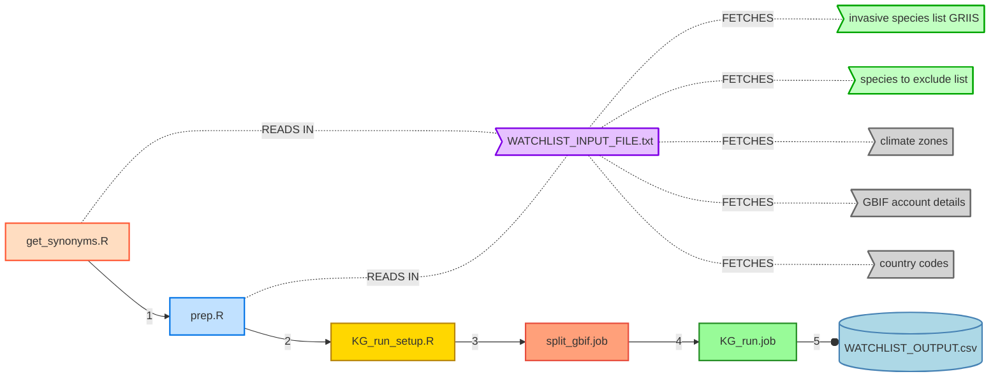

# ``WatchListR``
## Broad-scale Köppen-Geiger (KG) climate matching to generate watchlists for invasive species 

-------------------------------------


**Clarke J.M van Steenderen**    
clarke.vansteenderen@ru.ac.za  
**Guy F. Sutton**    
g.sutton@ru.ac.za  
**Philip Ivey**     
p.ivey@ru.ac.za

-------------------------------------

Centre for Biological Control    
Department of Zoology and Entomology    
Rhodes University      
Makhanda/Grahamstown    
6139    

-------------------------------------

## 📖 Summary

The ``WatchListR`` pipeline is targeted to any country of interest, and uses a global list of invasive species to generate a [watch]list of potential invaders that may be of concern based on a broad-scale climate matching approach. All available GBIF data for the species in this watchlist are downloaded, and the associated GPS records for each entry are scored as a Köppen-Geiger climate zone. The scored climate zones are subsequently matched to the climate zones present in the target country in order to determine the degree of climatic overlap for each species.

## Run instructions (Linux environment)

* Download this GitHub repository, and unzip the project folder
* Edit the **``WATCHLIST_INPUT_FILE.txt``** and the **split_gbif.sh** files according to the specific project requirements    
* Upload the project folder to your profile on a High Performance Computer (HPC) of choice
* Access a node of the HPC that has access to the Internet (since GBIF downloads require an Internet connection), e.g ``ssh cvansteenderen@globus.chpc.ac.za``
* cd (change the directory) to the relevant folder/directory on your HPC profile
* Add the most recent version of R as a module, e.g. ``module load chpc/BIOMODULES R/4.2.0``
* Run ``nohup Rscript get_synonyms.R &> get_synonyms.out &`` to search for all the available synonyms for each species on GBIF      
* Run ``Rscript prep.R`` to prepare the required input files for the analysis
* Run ``nohup Rscript KG_run_setup.R &> KG_run_setup.out &`` to start downloading from GBIF
* ssh to ``cvansteenderen@lengau.chpc.ac.za ``           
* Run ``qsub split_gbif.job`` to divide the large GBIF zipped folder into multiple small CSV files/chunks that are more manageable (i.e. can be read into R!)
* Run ``qsub KG_run.job`` to run **KG_run.R** to apply broad-scale climate matching for each smaller file, and collate them all again at the end



An example of the console input on the globus node (for Internet access) could be:      

```
ssh cvansteenderen@globus.chpc.ac.za
Cryophytum2024@!
cd /mnt/lustre/users/cvansteenderen/kg_watchlist_PROJECT1
module load chpc/BIOMODULES R/4.2.0
export LANG=en_US.UTF-8 
export LC_ALL=en_US.UTF-8
nohup Rscript get_synonyms.R &> get_synonyms.out &
Rscript prep.R       
nohup Rscript KG_run_setup.R &> KG_run_setup.out &         
```
💡The nohup part of the code means "no hangup", and allows the user to run additional tasks while the previous task is running, and/or keeps the code running even if the user logs off the HPC

Followed by the last two scripts on the normal HPC node:

```
ssh cvansteenderen@lengau.chpc.ac.za      
Cryophytum2024@!
cd /mnt/lustre/users/cvansteenderen/kg_watchlist_PROJECT1       
qsub split_gbif.job              
qsub KG_run.job    
```

💡To check the status of a qsub job, type:      
``qstat jobID``     
To cancel a job, type:    
``qdel jobID``     

💡 ``ssh -o "ServerAliveInterval 60" cvansteenderen@globus.chpc.ac.za`` will prevent the ssh console from timing out

## Workflow

This collection of R scripts follows the pipeline below:

* Input a CSV file containing a list of the genus and species names of invasive organisms of interest (e.g. from the Global Register of Introduced and Invasive Species [GRIIS](https://griis.org/) database. The list can be downloaded [here](https://zenodo.org/records/6348164)    
* Input the name of a country that is under potential threat from these species (focal country)     
* Remove (1) all taxa already recorded in the focal country, and (2) endemic species (if available) from the list       
* Input a list of the Köppen-Geiger zones present in the focal country      
* Download all occurence records from the Global Biodiversity Information Facility [GBIF](https://www.gbif.org/) database for the taxa in the input list      
* Extract the KG climate zone for each occurence record (GPS location)     
* Score whether the KG zones where the invasive species occur are shared with the KG zones present in the focal country (0 or 1)    
* Score the total number of records per species that share a KG zone with the focal country, and the overall proportions per climate zone       
* Output a single summary table    
  
💡The only files that the user needs to change are:    

1) ``WATCHLIST_INPUT_FILE.txt`` - change the project parameters (e.g. country name, KG zones)
2) ``split_gbif.job`` - change the file path for the project, the country name, and the number of rows to divide the large GBIF file into (defaults to 2 million -> should be fine, usually produces 1GB files), namely the lines:
    *   #PBS -o /mnt/lustre/users/cvansteenderen/KG_WATCHLIST_**COUNTRYNAME**/OUTPUTS/GBIF_DATA/stdout.txt
    *   #PBS -e /mnt/lustre/users/cvansteenderen/KG_WATCHLIST_**COUNTRYNAME**/OUTPUTS/GBIF_DATA/stderr.txt
    *   #PBS -N unzip_and_chunk_**COUNTRYNAME**
    *   BASE_DIR="/mnt/lustre/users/cvansteenderen/KG_WATCHLIST_**COUNTRYNAME**/OUTPUTS/GBIF_DATA"
    *   LINES_PER_FILE=**2000000**
4) ``KG_run.job``  - change the file path for the project and the country name, namely the lines:
    *   #PBS -o /mnt/lustre/users/cvansteenderen/KG_WATCHLIST_**COUNTRY**/KG_run_stdout.txt
    *   #PBS -e /mnt/lustre/users/cvansteenderen/KG_WATCHLIST_**COUNTRY**/KG_run_stderr.txt
    *   #PBS -N KG_run_**COUNTRY**
    *   cd /mnt/lustre/users/cvansteenderen/KG_WATCHLIST_**COUNTRY**

If specific changes need to be made to the filtering of the invasive species list before it is processed (e.g. more than one taxonomic kingdom, such as Plantae AND Animalia), then edits can be made in the ``get_synonyms.R`` file.

<br />


## Troubleshooting

⚠️ If your Internet connection is unstable, you might get the error:    
``Error occurred while fetching usageKey for species_name : any(content_types == "application/json") is not TRUE ``    
Ensure that you are running this R script on a computer that has an uninterrupted Internet connection and electricity supply

## Input file

Below is a template and an example of the **``WATCHLIST_INPUT_FILE.txt``** file that the user needs to edit accordingly. The name **WATCHLIST_INPUT_FILE** should not be changed, and neither should any of the parameters in capital letters in the file. Check the species list CSV file for the project to ensure the correct usage of the target country and taxonomic kingdom, and make sure that there is a single column in the file with both the genus and species name (no authority or other detail); for example ``Acacia saligna``, or ``Opuntia stricta``. The column name can be anything - here it is set to ``accepted_name.species``. Ensure that the same requirements are met for the file containing endemic species (if available); here it is ``full.tax.name``. If a list of endemics is not available, leave ``ENDEMICS LIST PATH`` and ``ENDEMICS NAME COLUMN`` blank. Enter the applicable Köppen-Geiger zones as numbers (see below for codes), separated by a comma. The file paths provided can be anything - as long as the relevant data is available at the specified path. 

### Template WATCHLIST_INPUT_FILE.txt

``SPECIES LIST PATH``	path/to/invasive_species_list.csv    
``ENDEMICS LIST PATH``	path/to/list_of_endemics.txt        
``TARGET COUNTRY``	country    
``KINGDOM``	taxonomic kingdom   
``ISO COUNTRY CODE``	country code (see ISO codes below)          
``SPECIES NAME COLUMN``	column in invasive species list specifying full taxonomic name (genus and species)       
``ENDEMICS NAME COLUMN``	column in endemic species list specifying full taxonomic name (genus and species)    
``KOPPEN-GEIGER ZONES``	koppen-geiger zone numbers (see table below), separated by a comma       
``GBIF USERNAME``	    
``GBIF EMAIL``	    
``GBIF PASSWORD``	    

### Example WATCHLIST_INPUT_FILE.txt

``SPECIES LIST PATH``	griis_data/griis_full_database.csv    
``ENDEMICS LIST PATH``	mau_endemics/native_flowering_plants_mau.txt        
``TARGET COUNTRY``	Mauritius    
``KINGDOM``	Plantae    
``ISO COUNTRY CODE``	MU    
``SPECIES NAME COLUMN``	accepted_name.species    
``ENDEMICS NAME COLUMN``	full.tax.name    
``KOPPEN-GEIGER ZONES``	1, 2, 3, 14    
``GBIF USERNAME``	gbifuser123    
``GBIF EMAIL``	johndoe@gmail.com    
``GBIF PASSWORD``	*** 		      

## 🐛 SPECIES LIST PATH -> the list of invasive species of interest

In this example, the file ``griis_full_database.csv`` contains 3083 plant species names that are a potential threat to Mauritius. The table below shows the first three species in this table. 

| scientific_name       | scientific_name_type | kingdom | establishment_means | is_invasive | occurrence_status | checklist.name | checklist.iso_countrycode_alpha3 | accepted_name.species | accepted_name.kingdom | accepted_name.phylum | accepted_name.class | accepted_name.order | accepted_name.family | accepted_name.habitat | accepted_name |
|-----------------------|----------------------|---------|---------------------|-------------|-------------------|----------------|----------------------------------|-----------------------|-----------------------|----------------------|---------------------|---------------------|----------------------|-----------------------|---------------|
| Abelmoschus moschatus | species              | Plantae | alien               | invasive    | present           | Cook Islands   | COK                              | Abelmoschus moschatus | Plantae               | Tracheophyta         | Magnoliopsida       | Malvales            | Malvaceae            | ["terrestrial"]       | NA            |
| Abies alba Mill.      | species              | Plantae | alien               | invasive    | present           | Sweden         | SWE                              | Abies alba            | Plantae               | Tracheophyta         | Pinopsida           | Pinales             | Pinaceae             | ["terrestrial"]       | NA            |
| Abrus precatorius L.  | species              | Plantae | alien               | invasive    | present           | Bahamas        | BHS                              | Abrus precatorius     | Plantae               | Tracheophyta         | Magnoliopsida       | Fabales             | Fabaceae             | ["terrestrial"]       | NA            |

## 🦋 ENDEMIC SPECIES LIST PATH -> the list of endemic taxa in the focal country

In this example, the file ``native_flowering_plants_mau.txt`` contains 695 endemic flowering plant species names that are endemic to Mauritius, taken from [GBIF](https://www.gbif.org/dataset/649fb99c-5bb1-4a3b-83df-7f9b3fe4dca6#description). The table below shows the first three species in this table. The column ``full.tax.name`` was created manually here to provide an input that contains the genus and species together.

| id | taxonID | acceptedNameUsageID | scientificName | namePublishedIn | namePublishedInYear | kingdom | phylum | class | order | family | genus | specificEpithet | full.tax.name | taxonRank | scientificNameAuthorship | vernacularName | taxonomicStatus |
|---|---|---|---|---|---|---|---|---|---|---|---|---|---|---|---|---|---|
| MUS_001 | MUS_001 |  | Barleria observatrix Bosser &   Heine |  |  | Plantae | Tracheophyta | Magnoliopsida | Lamiales | Acanthaceae | Barleria | observatrix | Barleria observatrix | species | Bosser & Heine |  | accepted |
| MUS_002 | MUS_002 |  | Dicliptera falcata (Lam.) Bosser   & Heine |  |  | Plantae | Tracheophyta | Magnoliopsida | Lamiales | Acanthaceae | Dicliptera | falcata | Dicliptera falcata | species | (Lam.) Bosser & Heine |  | accepted |
| MUS_003 | MUS_003 |  | Hypoestes serpens (Vahl)  R. Br. |  |  | Plantae | Tracheophyta | Magnoliopsida | Lamiales | Acanthaceae | Hypoestes | serpens | Hypoestes serpens | species | (Vahl)  R. Br. |  | accepted |

## 🍁 ISO country codes

**ISO country code options can be found here:**    
https://www.iso.org/obp/ui/#search 

## Köppen-Geiger zone numbers

**KG zone numbers are:**    

| Number  | Symbol   | Climate type                 |
|-----|-----|---------------------------------------|
| 1  | Af  |Tropical, rainforest                   |
| 2  | Am  | Tropical, monsoon                     |
| 3  | Aw  | Tropical, savannah                    |
| 4  | BWh | Arid, desert, hot                     |
| 5  | BWk | Arid, desert, cold                    |
| 6  | BSh | Arid, steppe, hot                     |
| 7  | BSk | Arid, steppe, cold                    |
| 8  | Csa | Temperate, dry summer, hot summer     |
| 9  | Csb | Temperate, dry summer, warm summer    |
| 10 | Csc | Temperate, dry summer, cold summer    |
| 11 | Cwa | Temperate, dry winter, hot summer     |
| 12 | Cwb | Temperate, dry winter, warm summer    |
| 13 | Cwc | Temperate, dry winter, cold summer    |
| 14 | Cfa | Temperate, no dry season, hot summer  |
| 15 | Cfb | Temperate, no dry season, warm summer |
| 16 | Cfc | Temperate, no dry season, cold summer |
| 17 | Dsa | Cold, dry summer, hot summer          |
| 18 | Dsb | Cold, dry summer, warm summer         |
| 19 | Dsc | Cold, dry summer, cold summer         |
| 20 | Dsd | Cold, dry summer, very cold winter    |
| 21 | Dwa | Cold, dry winter, hot summer          |
| 22 | Dwb | Cold, dry winter, warm summer         |
| 23 | Dwc | Cold, dry winter, cold summer         |
| 24 | Dwd | Cold, dry winter, very cold winter    |
| 25 | Dfa | Cold, no dry season, hot summer       |
| 26 | Dfb | Cold, no dry season, warm summer      |
| 27 | Dfc | Cold, no dry season, cold summer      |
| 28 | Dfd | Cold, no dry season, very cold winter |
| 29 | ET  | Polar, tundra                         |
| 30 | EF  | Polar, frost                          |                        

Beck, H.E., N.E. Zimmermann, T.R. McVicar, N. Vergopolan, A. Berg, E.F. Wood:
Present and future Köppen-Geiger climate classification maps at 1-km resolution,
Nature Scientific Data, 2018.

## 🦤 Example output

In the example, the focal country is Mauritius (``MU``). The KG zones in this country are ``1, 2, 3, 14``, which correspond to Af (tropical rainforest), Am (tropical monsoon), Aw (tropical savannah), and Cfa (humid subtropical), respectively.

An example output **final_sp_table.csv** might be (showing just the first two species):

| species | total_n | total_records_in_kg | prop_records_in_kg | total_records_in_1 | prop_records_in_1 | total_records_in_2 | prop_records_in_2 | total_records_in_3 | prop_records_in_3 | total_records_in_14 | prop_records_in_14 | total_records_in_15 | prop_records_in_15 | n_records_in_target_countries |
|---|---|---|---|---|---|---|---|---|---|---|---|---|---|---|
| Abelmoschus moschatus | 1389 | 1073 | 77.25 | 349 | 25.126 | 176 | 12.671 | 372 | 26.782 | 165 | 11.879 | 11 | 0.792 | 19 | 
| Abies alba | 68628 | 23643 | 34.45 | 0 | 0 | 0 | 0 | 1 | 0.001 | 195 | 0.28 | 23447 | 34.17 | 0 |

This table indicates that there were 1389 *A. moschatus* species downloaded from GBIF, and that 1073 of these shared KG zone/s with the KG zones present in Mauritius and Reunion (77%). Approximately 25% of the species records fell into KG zone 1, 13% in zone 2, 27% in zone 3, 12% in zone 14, and 1% in zone 15. A total of 19 of the 1389 records were already present in these two countries (1.4%). *Abies alba* seems to pose a lower threat, as only 34.5% of its records occurred in KG zones present in MU and RE. The bulk of these records (34.2%) came from KG zone 15 (temperate, no dry season, warm summer).

The ggplot.R script can thresholded the output list to produce graphics like this:


